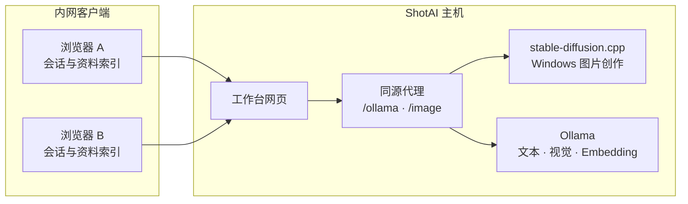

<p align="center">
  
</p>

<h1 align="center">ShotAI</h1>

<p align="center">
  <strong>把本地模型变成单位内部真正能用的 AI 工作台。</strong>
</p>

<p align="center">
  一台主机运行模型，其他电脑打开浏览器即可对话、看图、读文件和查询内部资料。
</p>

<p align="center">
  <a href="#它解决的不是模型而是使用模型这件事">产品定位</a> ·
  <a href="#从一台主机到多台浏览器">工作方式</a> ·
  <a href="#开始使用">开始使用</a> ·
  <a href="#能力与边界">能力边界</a> ·
  <a href="docs/LAN_DEPLOYMENT.md">内网部署</a>
</p>


## 它解决的不是模型，而是“使用模型”这件事

Ollama 已经能在本地运行模型，但把它交给一个单位使用，仍然要处理端口、代理、模型文件、图片能力、文档解析、会话记录和多台电脑访问。

ShotAI 位于模型运行时之上，把这些分散的问题收进一个浏览器工作台：

- 管理本机 Ollama 模型，并识别文本、视觉、思考、Embedding 等能力；
- 通过流式对话、附件、知识库和可中止任务，提供完整的日常交互；
- 由主机提供网页与同源代理，让内网客户端不必安装 Node.js、Ollama 或模型；
- 在 Windows 上通过 stable-diffusion.cpp 提供本地图片创作试用能力。

> 我做 ShotAI，不是为了重写一个推理引擎，而是希望使用者不必先理解推理引擎。Ollama 负责模型加载与计算，ShotAI 负责让这套能力可被普通人使用、检查和管理。

它更适合不能或不希望把资料发送到公有云、但需要在可信局域网内共享 AI 能力的团队。它不是云端账号系统，也不是面向公网开放的多租户服务。

## 从一台主机到多台浏览器



一次完整使用流程是：

1. 管理员在主机准备 Ollama 和需要的模型；Windows 图片创作还需图片运行组件与模型文件。
2. 主机启动 ShotAI，工作台与 `/ollama`、`/image` 代理在同一地址提供服务。
3. 使用者通过浏览器选择模型，输入问题，或添加图片、TXT、Markdown、PDF、DOCX。
4. 文档先在浏览器中解析；知识库内容被分块并可选生成 Embedding，相关片段随问题提交给本地模型。
5. 回答以 NDJSON 流式返回；使用者可以停止、编辑问题后重答、继续或重新生成。
6. 会话、偏好和知识库索引保存在当前浏览器的 IndexedDB 中，不会自动同步到其他电脑。

## 能力与边界

| 能力 | 当前状态 | 代码确认的边界 |
| --- | --- | --- |
| 本地流式对话 | 已实现 | 支持停止、继续、编辑问题重答、复制、重新生成和按对话保存参数 |
| 多会话管理 | 已实现 | 支持搜索、重命名、删除和导出；数据仅保存在当前浏览器 |
| 图片理解 | 已实现，取决于模型 | JPEG、PNG、WebP；当前模型必须被 Ollama 标记为 `vision` |
| 文档附件 | 已实现 | TXT、Markdown、PDF、DOCX；旧 `.doc` 会提示转换，扫描型 PDF 不包含 OCR 流程 |
| 本地知识库 | 已实现 | 900 字符分块、150 字符重叠；有 Embedding 模型时使用向量检索，否则回退到关键词检索 |
| 回答引用 | 已实现 | 展示来源文件、段落、匹配方式与摘录；引用来自检索片段，不是独立事实校验器 |
| 模型管理 | 已实现 | 读取版本、运行状态和能力；支持单 GGUF，视觉模型支持主模型 + `mmproj` 双文件导入 |
| 内网访问 | 已实现 | Node.js、PowerShell 与 Nginx 三种同源代理路径；客户端无需安装运行时；默认只有主机可以添加和删除模型 |
| 图片创作 | 已实现 / 取决于模型 | Windows 使用 stable-diffusion.cpp；支持聊天内文字生图、参考图修改、改动幅度、自动切换、进度、停止、预览、PNG 下载与本地历史 |
| 管理边界 | 已实现基础版 | 主机可管理模型，内网浏览器默认只使用；尚未提供账号登录、细分角色和用户隔离 |
| 服务端共享历史 | 未实现 | 会话、资料和生成历史不会跨浏览器同步 |
| 图片任务队列 | 未实现 | 多人同时生成时没有主机级串行队列或资源配额 |

## 本地数据与隐私边界

ShotAI 前端没有接入云端数据库或第三方 AI API。对话内容、设置、附件解析结果和知识库索引默认保存在浏览器 IndexedDB；推理请求通过 ShotAI 主机转发到回环地址上的 Ollama 或图片服务。

“本地”不等于“只有当前电脑可见”：内网客户端提交的提示词、图片和检索片段会通过局域网发送到主机。1.0 默认阻止内网浏览器添加或删除主机模型，但当前随项目提供的服务仍没有账号登录、TLS、访问名单或审计日志。因此：

- 只在可信、受控的局域网中运行当前版本；
- 不要把 `9090` 或 `/ollama`、`/image` 代理暴露到公网；
- 涉及敏感资料时，应在部署前补充 HTTPS、身份认证、接口白名单与审计；
- 不建议使用 `OLLAMA_ORIGINS=*`，项目已经通过同源代理处理浏览器来源问题。

## 开始使用

### 开发环境

已安装依赖所使用的 Vite 8 要求 Node.js `^20.19.0 || >=22.12.0`。主机还需要可访问的 [Ollama](https://ollama.com/)；仅浏览器客户端不需要安装它。

```bash
npm install
ollama serve
npm run dev
```

`ollama serve` 与 `npm run dev` 需要在两个终端中运行。工作台配置端口为 `5173`，地址通常是 `http://127.0.0.1:5173/`；若端口已占用，以 Vite 输出的实际地址为准。

安装任意文本模型即可开始普通对话。需要图片理解时，可以准备项目当前推荐的视觉模型：

```bash
ollama pull qwen3-vl:8b-instruct-q4_K_M
```

更大的 `qwen3-vl:30b-a3b-instruct-q4_K_M` 质量更高，但模型约 20 GB，并会使用更多显存或系统内存。视觉 GGUF 通常由主模型与 `mmproj` 文件组成，离线导入时应在“模型管理”中同时选择同一版本的两个文件。

### 构建工作台

```bash
npm run build
npm run preview
```

生产构建输出到 `dist/`。构建目标为 Chrome 80、Edge 80、Firefox 78、Safari 13.1 及之后版本；较旧且不支持 ES Modules 的浏览器会显示升级提示。

### 运行门户网站

门户与工作台是两个独立的 Vite 项目：

```bash
cd portal
npm install
npm run dev
```

门户配置端口为 `5174`，通常访问 `http://127.0.0.1:5174/`。未配置工作台地址时，门户按钮会跳转到部署说明，而不会假定访问者本机运行了 ShotAI。

构建时可通过已实现的环境变量连接真实工作台：

```bash
VITE_WORKBENCH_URL=http://192.168.1.20:9090 npm run build
```

门户构建会把 JavaScript 与 CSS 内联到 HTML。执行 `npm run package:static` 后，独立交付目录位于 `release/ShotAI-1.0.0-Portal-Static/`。

## Windows 内网部署

### Electron 桌面客户端

1.1 版本使用 Electron 提供 Windows 桌面窗口、任务栏图标和托盘菜单。Electron
主进程直接提供 9090 网页并转发 Ollama 与图片服务，不再运行 PowerShell 网页
脚本，因此不会再出现 Windows PowerShell 5.1 中文编码导致的启动失败。

```bash
npm run build:win
```

安装包不包含模型。关闭窗口后内网服务继续运行，可以从托盘重新打开或退出。
完整说明见 [Electron Windows 客户端说明](docs/ELECTRON_WINDOWS_GUIDE.md)。

```bash
npm run package:lan
```

命令会重新生成 `release/shotai-lan/`，其中包含工作台网页、Node.js / PowerShell 服务脚本、Nginx 示例、Windows 启动器，以及仓库中存在时的 stable-diffusion.cpp Windows CUDA 图片运行组件。

1.0 正式包已经包含 Ollama v0.32.5 Windows x64 免安装运行组件和 stable-diffusion.cpp 图片运行组件，目标主机不需要安装 Node.js、Ollama 或 Python。模型权重不会随项目发布，管理员可以在主机工作台中选择下载好的模型文件。

部署完成后：

1. 主机运行 `start-windows.bat`；Linux 可运行 `start-linux.sh`。
2. 主机访问 `http://127.0.0.1:9090`。
3. 其他电脑访问启动窗口显示的 `http://主机IP:9090`。
4. 图片模型可在主机“创作图片”页面直接选择；三文件模型一次选中三个文件即可。

完整配置、Windows 防火墙、Nginx 反向代理和图片运行组件说明见 [内网部署文档](docs/LAN_DEPLOYMENT.md)。

### 轻量 EXE 预览版

1.1 预览版新增原生 Windows x64 `ShotAI.exe`，不使用 Electron。它会请求
管理员权限、准备便携模型目录、启动可用的 Ollama 和图片服务、开放 9090、
自动打开浏览器，并在安全退出时清理本次启动的子进程。EXE 已写入 ShotAI 图标，
双击后不会显示黑色控制台窗口，运行信息保存在 `logs`。

```bash
SHOTAI_GO_BIN=/path/to/go npm run package:windows-lite
```

产物位于 `release/ShotAI-1.1.0-EXE-Lite/`。该精简包约 15MB，不含模型权重、
Ollama 和图片生成运行组件；已经安装 Ollama 的 Windows 主机可以直接测试。
完全免安装时，把可选运行组件复制到对应的 `runtime` 目录。详见
[EXE 精简版说明](docs/EXE_LITE_GUIDE.md)。

针对 NVIDIA 4070 Ti 等显卡，还可以执行 `npm run package:windows-chat-ready`
生成 CUDA 12 对话免安装包。它包含必要的 Ollama 运行文件，但排除了 CUDA 13、
Vulkan、图片生成组件和所有模型权重，压缩后约 900MB。

图片生成组件保持独立，执行 `npm run package:windows-image-runtime` 可生成 CUDA 12
可选组件包。把组件包内的 `runtime` 文件夹合并进任一 EXE 包即可，仍不包含模型。

## 为什么这些实现值得保留

- **同源而不是放开 Ollama**：Vite、Node.js、PowerShell 与 Nginx 代理都会移除浏览器的 `Origin` / `Referer`，让 Ollama 继续只监听回环地址，避免用全局跨域开关换取便利。
- **文档解析按需加载**：PDF.js 只在选择 PDF 时加载，减少旧版内网浏览器首次打开工作台的负担；DOCX 使用 Mammoth 在浏览器本地提取文本。
- **检索可以降级**：Embedding 不可用或查询失败时仍可使用中英文关键词与中文二元组匹配，不会让知识库入口完全失效。
- **模型文件先校验再写入**：GGUF 导入会检查文件头、分块计算 SHA-256、复用 Ollama Blob，并在创建后发起最小对话验证；视觉双文件还会再次确认 `vision` 能力。
- **推理与产品层分开**：前端只依赖 Ollama API 契约与独立图片接口，后续可以在不重做交互层的前提下抽象其他推理 Provider。

## 常用命令

| 命令 | 作用 |
| --- | --- |
| `npm run dev` | 启动工作台开发服务器 |
| `npm run build` | 类型检查并构建工作台 |
| `npm run preview` | 在 `9090` 端口预览工作台构建 |
| `npm run serve:lan` | 使用 Node.js 提供网页、健康检查和本地服务代理 |
| `npm run package:lan` | 生成 Windows / Linux 内网交付目录 |
| `npm run package:windows-lite` | 生成不含模型和大型运行组件的 Windows EXE 精简包 |
| `npm run package:windows-chat-ready` | 生成包含 Ollama CUDA 12 的 Windows EXE 对话包 |
| `npm run package:windows-image-runtime` | 生成不含模型的 Windows CUDA 12 图片生成组件包 |
| `npm run check:windows-launcher` | 检查 EXE 架构、体积、便携目录和精简包内容 |
| `npm run check:lan-proxy` | 验证 Ollama 与图片服务代理会清理浏览器来源头 |
| `npm run check:ollama` | 验证工作台到 Ollama 的基础 API 契约 |
| `npm run check:chat-ux` | 验证长输入、停止、编辑重试和设置入口 |
| `npm run check:attachment-ui` | 验证附件解析、发送和本地恢复 |
| `npm run check:rag-ui` | 知识库交互检查；当前脚本仍依赖旧版界面文案，待更新后再作为发布门禁 |
| `npm run check:vision-ui` | 验证视觉模型识别与图片提示 |
| `npm run check:vision-import` | 验证视觉主模型与 `mmproj` 配对导入 |
| `npm run check:image-generation` | 验证文字生图、参考图修改、改动幅度、进度、预览与下载 |
| `npm run check:image-package` | 验证 Windows 图片运行组件与发布包结构 |
| `npm run check:v1-ui` | 验证 1.0 版本标识与主机 / 内网管理边界 |

`npm run check:plain-language` 还会检查门户文案，执行前需同时启动工作台 `5173` 与门户 `5174`。门户项目另有 `build`、`preview`、`package:static` 和 `check:static` 命令，均需在 `portal/` 目录执行。

## 项目结构

```text
ShotAI/
├─ src/                       # 工作台界面与本地业务逻辑
│  └─ services/               # Ollama、图片、知识库与 IndexedDB
├─ scripts/                   # 服务、打包、Mock 与交互检查
├─ deploy/
│  ├─ lan/                    # Windows / Linux 内网启动脚本
│  └─ nginx/                  # 同源代理示例
├─ portal/                    # 独立产品门户
├─ docs/                      # 架构、部署与图片创作说明
├─ public/                    # 工作台品牌资源
├─ vendor/                    # 可选的第三方离线运行组件
├─ lan.config.json            # 内网服务与图片运行时配置
└─ vite.config.ts             # 工作台构建、端口与开发代理
```

## 已知不足与下一步

以下内容在现有代码中尚未完成，不应当被视为当前功能：

- 主机级身份认证、角色权限、HTTPS、操作审计与接口白名单；
- 多人共享会话、知识库和图片生成历史；
- 图片生成队列、并发限制、显存不足的专门提示与资源配额；
- 对随包运行组件建立自动更新、回退和更细的版本兼容检查；
- 首次启动时对 GPU、端口、磁盘、运行时和模型完整性进行统一自检；
- 抽象 `InferenceProvider`，接入 llama.cpp、vLLM 或其他本地运行时。

路线选择与边界讨论见 [产品架构说明](docs/PRODUCT_ARCHITECTURE.md) 和 [图片创作方案](docs/IMAGE_GENERATION_PLAN.md)。

## 发布说明

当前正式版本为 **1.0.0**。完整变更见 [CHANGELOG.md](CHANGELOG.md)，第一次部署和非技术使用说明见 [1.0 使用手册](docs/USER_GUIDE.md)。仓库根目录尚未提供项目许可证，因此在添加 `LICENSE` 前，不能默认将 ShotAI 视为允许复制、修改或再分发的开源项目。

`vendor/stable-diffusion.cpp/windows/` 内包含其自身的 MIT 许可证与来源校验信息；这些第三方许可不等同于 ShotAI 项目许可证。
