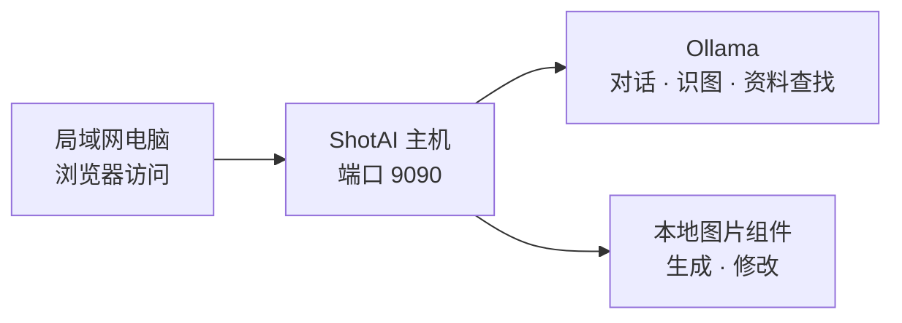

<p align="center">
  <a href="http://alexjoker.top/projects/ShotAI/">
    
  </a>
</p>

<h1 align="center">ShotAI</h1>

<p align="center">
  <strong>让一台电脑，成为整个局域网的本地 AI 工作台。</strong>
</p>

<p align="center">
  对话 · 文件阅读 · 资料查找 · 图片理解 · 图片创作
</p>

<p align="center">
  
  
  
  
</p>

<p align="center">
  <a href="http://alexjoker.top/projects/ShotAI/">产品介绍</a> ·
  <a href="docs/USER_GUIDE.md">使用指南</a> ·
  <a href="docs/LAN_DEPLOYMENT.md">内网部署</a> ·
  <a href="docs/README.md">全部文档</a>
</p>


## 一台主机，所有人直接使用

ShotAI 把本地模型、文件、资料库和图片能力放进同一个网页。管理员只需在主机准备运行组件和模型，局域网内的其他电脑打开浏览器即可使用，无需分别安装 Node.js、Ollama 或模型。



## 已经可以做什么

| 能力 | 使用体验 | 当前支持 |
| --- | --- | --- |
| AI 对话 | 流式回答，可停止、重答、继续和编辑问题 | 本地 Ollama 模型 |
| 文件阅读 | 添加文件后直接提问 | TXT、Markdown、PDF、DOCX、Excel |
| 图片理解 | 上传图片并让模型分析 | PNG、JPEG、WebP 与视觉模型 |
| 本地资料库 | 从导入资料中查找答案并显示来源 | Embedding 或关键词检索 |
| 图片创作 | 在对话框内生成图片、参考图修改 | 本地图片模型与运行组件 |
| 模型管理 | 一个入口完成识别、导入、查看和清理 | GGUF、mmproj 与图片配套文件 |
| 内网共享 | 主机运行，其他电脑用浏览器访问 | Windows Electron 与 9090 服务 |

## 三步开始

### Windows 使用者

1. 安装并启动 ShotAI；
2. 在“模型管理”中添加已经下载好的模型；
3. 将界面显示的 `http://主机IP:9090` 发给局域网使用者。

模型不会随源码仓库提供。第一次部署请先阅读 [使用指南](docs/USER_GUIDE.md) 和 [内网部署说明](docs/LAN_DEPLOYMENT.md)。

### 本地开发

```bash
npm install
ollama serve
npm run dev
```

工作台通常运行在 `http://127.0.0.1:5173/`。构建与检查命令见 [开发流程](docs/DEVELOPMENT_WORKFLOW.md)。

## 模型如何分工

ShotAI 会根据任务使用对应能力，不要求使用者频繁手动切换。

| 任务 | 需要准备 |
| --- | --- |
| 普通对话 | 一个聊天模型 |
| 分析图片 | 支持图片理解的主模型；部分 GGUF 还需要同版本 `mmproj` |
| 查找资料 | 可选 Embedding 模型；未配置时自动使用关键词查找 |
| 生成或修改图片 | 图片主模型及其文本编码器、VAE 和本地图片运行组件 |

相同的模型文件只保存一份，可以被多个功能共同使用。兼容范围和导入排错见 [内网部署说明](docs/LAN_DEPLOYMENT.md)。

## 文档

| 我想了解 | 从这里开始 |
| --- | --- |
| 第一次安装和使用 | [第一次使用指南](docs/USER_GUIDE.md) |
| 在单位局域网中运行 | [内网部署与排错](docs/LAN_DEPLOYMENT.md) |
| Windows 客户端与打包 | [Electron 客户端说明](docs/ELECTRON_WINDOWS_GUIDE.md) |
| 当前功能与边界 | [1.2 功能说明](docs/SHOTAI_1.2_FEATURES.md) |
| 开发、检查和发布 | [开发流程](docs/DEVELOPMENT_WORKFLOW.md) |
| 查看全部说明 | [文档中心](docs/README.md) |

<details>
<summary><strong>使用前需要知道的边界</strong></summary>

- 当前没有账号登录、HTTPS、审计日志或跨浏览器共享记录；
- 会话、设置和资料索引默认保存在当前浏览器；
- 多人同时运行大模型或生成图片时，速度与稳定性取决于主机配置；
- 扫描 PDF 暂不支持文字识别，旧版 `.doc` 需要先转换为 `.docx`；
- 请只在可信局域网使用，不要把 `9090` 或模型接口直接开放到公网。

</details>

## 项目说明

ShotAI 负责模型管理、交互体验、文件处理和局域网共享；Ollama 与本地图片组件负责实际计算。项目不会把模型权重、大型运行组件或历史安装包提交到源码仓库。

完整变更见 [CHANGELOG.md](CHANGELOG.md)。仓库当前尚未提供项目许可证，在添加 `LICENSE` 前，请勿默认复制、修改或重新分发项目内容。
