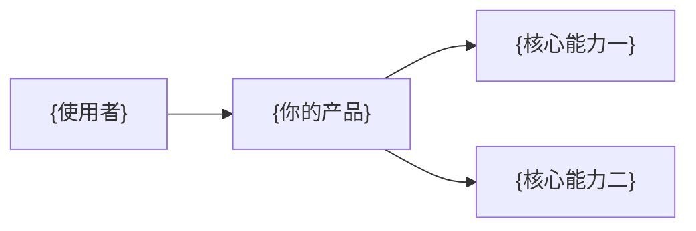

<!--
使用方法：
1. 将本文件复制到新项目根目录并命名为 README.md。
2. 替换所有 {占位内容}，删除不需要的章节和这段说明。
3. 建议准备一张 1440×500 品牌头图、一张 16:9 产品截图和一张功能概览图。
4. 首页只放帮助使用者快速理解和开始使用的内容，细节放到 docs/。
-->

<p align="center">
  <a href="{产品网站或项目地址}">
    
  </a>
</p>

<p align="center">
  
  
  
</p>

<p align="center">
  <a href="{产品介绍链接}">产品介绍</a> ·
  <a href="{使用指南链接}">使用指南</a> ·
  <a href="{部署文档链接}">部署说明</a> ·
  <a href="{更新记录链接}">更新记录</a>
</p>

<br />

<p align="center"><sub>THE PRODUCT / 产品界面</sub></p>


<p align="center"><sub>{一句简短的截图说明}</sub></p>

<p><sub>01 / OVERVIEW</sub></p>

## {一句简短的价值标题}

{用两到三句话说明项目解决的问题、核心使用方式和适合人群。不要在这里介绍实现细节。}



<p><sub>02 / CAPABILITIES</sub></p>

## 核心能力


| 能力 | 使用体验 | 当前支持 |
| --- | --- | --- |
| {能力一} | {使用者如何操作} | {支持范围} |
| {能力二} | {使用者如何操作} | {支持范围} |
| {能力三} | {使用者如何操作} | {支持范围} |
| {能力四} | {使用者如何操作} | {支持范围} |

<p><sub>03 / GET STARTED</sub></p>

## 三步开始

1. {第一步：安装或准备环境}；
2. {第二步：完成最少配置}；
3. {第三步：打开并开始使用}。

```bash
{安装命令}
{启动命令}
```

默认访问地址：`{本地地址}`。

<p><sub>04 / WORKFLOW</sub></p>

## 工作方式

| 场景 | 需要准备 | 得到什么 |
| --- | --- | --- |
| {场景一} | {前置条件} | {结果} |
| {场景二} | {前置条件} | {结果} |
| {场景三} | {前置条件} | {结果} |

<p><sub>05 / DOCUMENTATION</sub></p>

## 文档

| 我想了解 | 从这里开始 |
| --- | --- |
| 第一次使用 | [{使用指南名称}]({链接}) |
| 安装与部署 | [{部署文档名称}]({链接}) |
| 功能和边界 | [{功能说明名称}]({链接}) |
| 参与开发 | [{开发文档名称}]({链接}) |

<details>
<summary><strong>当前边界与已知问题</strong></summary>

- {尚未支持的功能一}；
- {尚未支持的功能二}；
- {使用时需要注意的风险或限制}。

</details>

## 项目结构

```text
{项目目录}/
├─ {主要目录一}/       # {用途}
├─ {主要目录二}/       # {用途}
├─ docs/              # 使用与开发文档
└─ README.md
```

## 参与项目

欢迎通过 Issue 提交问题和建议。准备代码修改前，请先阅读 [{贡献说明名称}]({链接})。

## 许可证

{许可证名称与说明。若尚未添加许可证，请明确说明代码不能被默认复制、修改或重新分发。}
