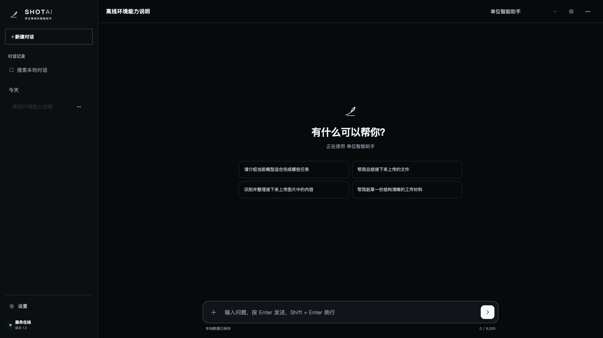

# ShotAI 1.2 功能说明

> 本文按当前工作区准备发布的 ShotAI 1.2 功能编写。
> 当前根目录 package.json 与 portal/package.json 中的版本号仍为 1.1.3；
> 正式发布 1.2 前，请同步修改两个版本号并更新 CHANGELOG.md。

  

ShotAI 1.2 是一个运行在本地硬件和可信局域网中的 AI 工作台。它不重新实现模型推理，而是把 Ollama、文档解析、知识检索、视觉理解、图片创作和 Windows 内网交付组织成一套可使用、可检查、可部署的工具。

## 这一版适合谁

ShotAI 适合以下场景：

- 团队不希望把资料、图片和提示词发送到公有云；
- 需要由一台主机运行模型，其他电脑通过浏览器使用；
- 需要同时处理普通对话、图片理解、文档问答和本地图片创作；
- 需要 Windows 主机上的桌面启动、托盘管理和局域网访问；
- 希望模型文件、会话记录和推理服务保留在自己的设备或内网中。

它不是公网多租户 SaaS，也不是带账号体系的云端服务。当前版本应部署在可信、受控的局域网中。

## 1.2 的核心能力

### 1. 本地流式对话

- 通过 Ollama 运行本地文本模型；
- 支持流式回答、停止生成、继续生成和重新生成；
- 可以编辑原问题后重新回答；
- 支持复制回答、导出会话、搜索、重命名和删除会话；
- 每个会话可以保存模型与回答参数。

回答内容不会自动发送到第三方 AI API。推理请求由 ShotAI 转发给主机上的 Ollama。

### 2. 图片理解

- 支持在对话中添加 JPG、PNG 和 WebP；
- 自动识别当前模型是否具备 vision 能力；
- 视觉模型不可用时给出明确提示，而不是静默失败；
- 支持视觉主模型与 mmproj 配套文件的组合导入；
- 图片会随当前对话保存到浏览器本地数据中。

图片理解能力取决于所选择的 Ollama 模型，不是所有文本模型都能识别图片。

### 3. 文档附件与本地问答

当前支持：

- TXT
- Markdown
- PDF
- DOCX

文档默认在浏览器中解析，然后作为当前问题的上下文发送给本地模型。旧格式 DOC 不包含独立解析流程，需要先转换为 DOCX。

当前版本没有扫描型 PDF 的 OCR 能力，因此纯图片 PDF 可能无法提取出有效文字。

### 4. 本地知识库与引用

ShotAI 可以把文档加入浏览器本地知识库：

- 文档按约 900 字符分块；
- 相邻分块默认保留约 150 字符重叠；
- 有 Embedding 模型时使用向量检索；
- Embedding 不可用或查询失败时，回退到关键词和中文匹配；
- 回答中展示来源文件、段落、匹配方式和摘录；
- 知识库索引保存在当前浏览器的 IndexedDB。

引用表示模型使用了哪些检索片段，不等同于独立的事实核验或权限审计。

### 5. GGUF 模型导入检查

模型导入不再只依赖文件名或简单文件头判断。当前会检查：

- GGUF 版本；
- 张量数量；
- 模型说明信息；
- 文件完整性与分块 SHA-256；
- Ollama Blob 是否可复用；
- 模型创建后的最小推理验证；
- 视觉模型主文件与 mmproj 的配对关系。

不完整或旧格式文件会在导入前给出处理提示，减少上传数 GB 文件后才失败的情况。

### 6. 本地图片创作与参考图修改

Windows 图片运行组件使用 stable-diffusion.cpp。当前支持：

- 文字生成图片；
- 添加一张 JPG、PNG 或 WebP 参考图；
- 根据文字描述修改参考图；
- 自动按参考图比例选择输出形状；
- 调整参考图改动幅度；
- 生成过程中显示进度；
- 停止当前任务；
- 生成结果预览；
- 下载 PNG；
- 在当前浏览器恢复最近的生成记录；
- 通过主机代理让内网浏览器使用图片服务。

图片创作依赖独立的图片运行组件和模型文件，不会因为安装 ShotAI 就自动获得模型权重。

### 7. 一台主机，多台浏览器

ShotAI 主机通过同源服务提供：

- 工作台网页；
- Ollama API 代理；
- 图片运行时代理；
- 健康检查接口；
- Windows 和 Linux 内网启动方式。

默认端口：

| 服务 | 地址 | 作用 |
| --- | --- | --- |
| ShotAI 内网服务 | 主机IP:9090 | 网页、健康检查与代理 |
| Ollama | 127.0.0.1:11434 | 文本、视觉和 Embedding 模型 |
| 图片运行组件 | 127.0.0.1:1234 | stable-diffusion.cpp 图片接口 |

其他电脑只需要浏览器，不需要安装 Node.js、Ollama 或模型。

当前默认管理边界是：主机可以管理模型和运行组件，内网浏览器主要负责使用。当前没有账号登录、角色权限和用户隔离。

### 8. Windows Electron 桌面客户端

1.2 的 Windows 桌面交付基于 Electron：

- 提供独立桌面窗口；
- 提供任务栏图标和托盘菜单；
- Electron 主进程直接提供 9090 网页和本地服务转发；
- 关闭窗口后可以继续为内网提供服务；
- 可以从托盘重新打开或彻底退出；
- 安装程序默认不包含模型；
- 卸载时默认保留模型、设置和日志；
- 启动日志写入 logs，便于定位端口、服务和权限问题。

### 9. 门户网站

独立门户位于 portal/，与工作台分开构建：

- 黑色、白色和绿色状态色组成工业感视觉语言；
- 首页展示真实产品界面和使用流程；
- 支持产品能力、工作流程和局域网使用说明；
- 当前工作区增加了 GitHub 项目入口；
- 可以通过 VITE_WORKBENCH_URL 配置“打开工作台”的地址；
- 构建后可以作为单 HTML 静态页面部署。

## 使用方式

### 开发工作台

~~~bash
npm install
ollama serve
npm run dev
~~~

工作台开发地址通常为：

http://127.0.0.1:5173/

### 开发门户

~~~bash
cd portal
npm install
npm run dev
~~~

门户开发地址通常为：

http://127.0.0.1:5174/

### 构建工作台

~~~bash
npm run build
npm run preview
~~~

### 构建门户

~~~bash
cd portal
npm run build
~~~

### 运行局域网服务

~~~bash
npm run serve:lan
~~~

生产网页默认由内网服务使用 9090 提供。

## Windows 发布包

根据目标主机的运行环境选择对应命令：

~~~bash
# 通用内网交付目录
npm run package:lan

# Electron Windows 安装包
npm run build:win

# Electron 完整包
npm run electron:pack:win:full

# 不含大型运行组件的 Windows 精简启动器
SHOTAI_GO_BIN=/path/to/go npm run package:windows-lite

# 包含 Ollama 的对话包
npm run package:windows-chat-ready

# 独立图片运行组件包
npm run package:windows-image-runtime
~~~

发布目录位于 release/，不应提交到 Git 仓库。模型权重、CUDA 运行组件和大型 DLL 应通过 GitHub Releases 或内部文件分发渠道提供。

## 隐私与安全边界

ShotAI 的本地数据主要保存在当前浏览器 IndexedDB，包括：

- 对话；
- 设置；
- 附件解析结果；
- 知识库索引；
- 最近生成记录。

但局域网客户端的提示词、图片和检索片段会经过网络发送到 ShotAI 主机。因此：

- 只在可信局域网部署；
- 不要把 9090、/ollama 或 /image 暴露到公网；
- 不要使用 OLLAMA_ORIGINS=* 代替同源代理；
- 对敏感资料使用前，应补充 HTTPS、身份认证、接口白名单和审计日志；
- 不要把 Token、私钥、用户数据或模型权重提交到 GitHub。

## 当前已知边界

以下能力不属于当前 1.2 已实现范围：

- 账号登录和多租户；
- 细分角色权限与用户隔离；
- HTTPS、访问名单和审计日志；
- 跨浏览器共享会话、知识库和图片历史；
- 主机级图片任务队列、并发限制和显存配额；
- 扫描型 PDF OCR；
- 模型权重自动下载和自动更新；
- 对 GPU、端口、磁盘、运行时和模型的统一首次启动自检。

## 适合写入 GitHub Release 的内容

发布 1.2 时，建议在 GitHub Release 中使用以下结构：

1. 一句话说明：本版本把本地对话、视觉、知识库、图片修改和 Windows 内网交付整合到同一工作台。
2. 列出新增能力：参考图修改、GGUF 完整性校验、Electron 客户端、门户 GitHub 入口。
3. 列出运行要求：Node.js、Ollama、Windows 图片组件和模型文件。
4. 明确模型权重不随源码发布。
5. 明确当前仅建议部署在可信局域网。
6. 附上对应安装包和校验信息。

## 相关文档

- [主 README](../README.md)：项目定位、快速开始和完整能力边界
- [用户指南](USER_GUIDE.md)：面向使用者的启动和使用说明
- [内网部署](LAN_DEPLOYMENT.md)：端口、防火墙、代理和运行组件
- [Electron Windows 客户端](ELECTRON_WINDOWS_GUIDE.md)：桌面客户端与安装方式
- [开发与代码更新流程](DEVELOPMENT_WORKFLOW.md)：独立的 Git 工作流和验证流程
- [更新记录](../CHANGELOG.md)：按版本整理的变化

